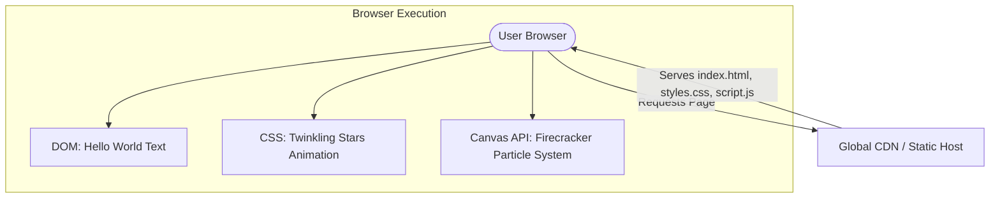

# Architecture Decision Record

## Request
build a simple web page with a black background and white text saying hello world with firecrackers type of graphic in the background and twinkling stars

## Option 1: Single-Page Static Web App (HTML5 Canvas & CSS)
A pure frontend static website consisting of a single HTML5 file, utilizing CSS keyframe animations for twinkling stars and an HTML5 Canvas particle system for the firecracker effects. It requires no backend and can be served directly from a CDN or static hosting provider.

**Components:** HTML5 (Structure & Canvas element), CSS3 (Black background, typography, twinkling star animations using keyframes), Vanilla JavaScript (Canvas API for firecracker/firework particle physics), Static Web Host (Vercel, Netlify, or GitHub Pages)

**Pros:** Zero server-side maintenance or hosting costs; Instantaneous load times and optimal performance (60 FPS animations); No build steps or complex dependency trees; Highly secure with no server-side attack surface

**Cons:** No server-side state or persistence (not required for this project); Harder to scale if complex database interactions are added later

**CTQ:** Smooth 60 FPS rendering of firecracker particles; Responsive layout adapting to mobile and desktop screens; Lightweight page weight under 50KB

## Option 2: React Single Page Application with Vite
A modern frontend SPA built using React and Vite, utilizing Tailwind CSS for styling and a canvas-based library (like tsParticles) to handle the firecracker and star animations.

**Components:** React (UI Framework), Vite (Build tool and dev server), Tailwind CSS (Styling and animations), tsParticles / Canvas library (Firecracker physics)

**Pros:** Component-based architecture makes it easy to add interactive UI elements later; Rich ecosystem of animation libraries; Hot Module Replacement (HMR) for rapid development

**Cons:** Overengineered for a simple static visual page; Requires a build step and node_modules dependencies; Larger bundle size and slower initial load time compared to vanilla JS

**CTQ:** Bundle size optimization; Preventing memory leaks from React component re-renders during canvas animations

## Decision
Chosen: **option1**

Option 1 is chosen because the request is purely visual and presentational. There is absolutely no dynamic data, user authentication, or server-side logic required. Implementing a backend or even a heavy frontend framework like React would introduce unnecessary complexity, larger bundle sizes, and build-step overhead. A vanilla HTML5/CSS3/JS approach with Canvas delivers the highest possible performance, perfect 60 FPS animations, and can be hosted completely free on static hosting platforms.

## ADR
# Architectural Decision Record (ADR)

## Status
Accepted

## Context
The client requires a simple web page with a black background, white 'Hello World' text, twinkling stars, and a firecracker graphic/animation in the background.

## Decision
We will build this as a pure static single-page application (Option 1) using standard HTML5, CSS3, and Vanilla JavaScript. 
- **Twinkling Stars**: Implemented using CSS keyframe animations manipulating opacity on absolute-positioned elements.
- **Firecrackers**: Implemented using an HTML5 `<canvas>` element and a lightweight custom particle physics engine in Vanilla JS to render exploding firecrackers at random intervals or on click.
- **Backend**: Completely omitted. The site will be hosted on a global CDN (e.g., Cloudflare Pages or Vercel) as static assets.

## Consequences
- **Performance**: Near-instantaneous First Contentful Paint (FCP) and smooth 60fps rendering.
- **Cost**: $0 hosting costs under standard free tiers.
- **Maintenance**: Zero package updates, security patches, or server maintenance required.
- **Extensibility**: If dynamic features are needed in the future, they can be integrated via client-side API fetches to serverless functions.

## Diagram

