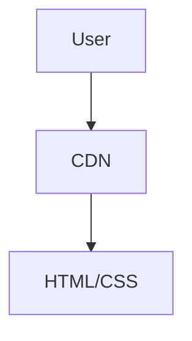

# Architecture Decision Record

## Request
build a simple web page with a black background and white text saying hello world.

## Option 1: Static HTML/CSS on CDN
Serve a single HTML file with inline CSS via a CDN or static hosting service.

**Components:** HTML file, CSS, CDN/static host

**Pros:** Zero server cost; Instant deployment; No backend maintenance

**Cons:** Limited to static content; No dynamic features

**CTQ:** Must be accessible via HTTPS; Responsive to user agent

## Option 2: Node.js Express Static Server
A minimal Express app that serves the static HTML file.

**Components:** Node.js runtime, Express framework, Static middleware, HTML file, CSS

**Pros:** Easy to extend with API endpoints later; Local dev server

**Cons:** Requires Node runtime; More deployment steps

**CTQ:** Must expose port 80/443; Handle CORS if needed

## Decision
Chosen: **option1**

The request only requires a static page; adding a backend adds unnecessary complexity, cost, and maintenance. A CDN-hosted static site is the simplest, fastest, and most cost-effective solution.

## ADR
# Architecture Decision Record

## Context
The goal is to deliver a single web page with a black background and white "Hello World" text. No dynamic content or server-side logic is required.

## Decision
Deploy the page as a static HTML file served from a CDN or static hosting service (e.g., GitHub Pages, Netlify, Vercel).

## Alternatives
1. **Static HTML/CSS on CDN** – minimal, zero backend. 
2. **Node.js Express Static Server** – adds a lightweight backend that can be extended later.

## Rationale
- **Simplicity**: No server code to write or maintain.
- **Cost**: Free hosting options exist for static sites.
- **Performance**: CDN edge caching delivers content with low latency.
- **Future-proofing**: If later requirements change, the static site can be migrated to a backend with minimal effort.

## Consequences
- The site is limited to static content; any future dynamic features will require adding a backend.
- Deployment is straightforward but may involve a build step if using a static site generator.

---

## Decision Status
Approved.

## Diagram

