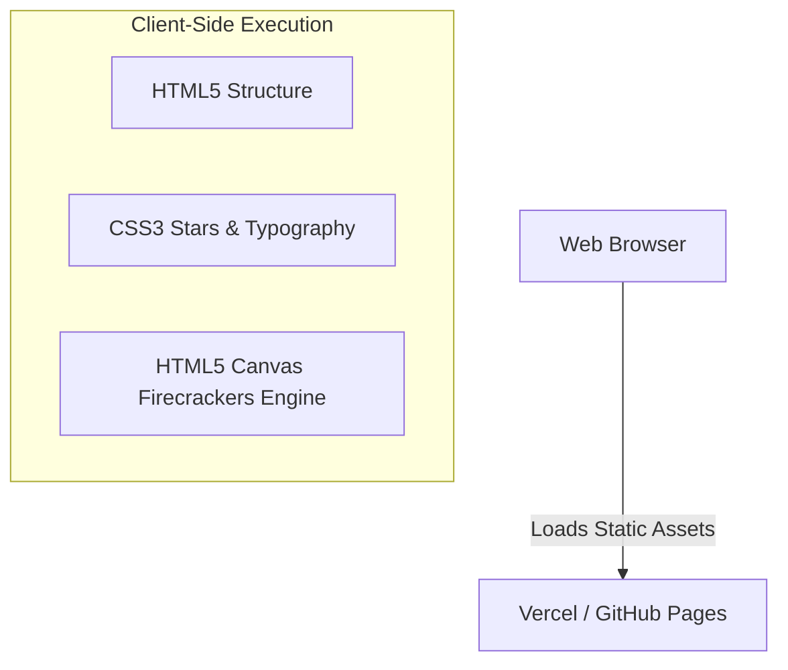

# Architecture Decision Record

## Request
build a simple web page with a black background and white text saying hello world with firecrackers type of graphic in the background and twinkling stars.

## Option 1: Static Client-Side SPA (Pure HTML/CSS/Canvas)
A lightweight, zero-backend static web page utilizing HTML5 Canvas for animated firecrackers and CSS animations for twinkling stars against a solid black background.

**Components:** Static HTML5 Document, Vanilla CSS3 (Layout, Typography, Star Animations), HTML5 Canvas API + Vanilla JavaScript (Particle Physics for Firecrackers), Static Web Host (Vercel / GitHub Pages)

**Pros:** Extremely fast load times and minimal resource footprint; Zero infrastructure cost and zero maintenance (no server to patch); Completely self-contained client-side execution

**Cons:** No dynamic server-side persistence or user accounts (not needed for this use case); Heavy particle animations run entirely on the client's CPU/GPU

**CTQ:** Sub-second load time; 60 FPS smooth canvas rendering; Zero server dependencies

## Option 2: SSR Web Application with Microservice Particle Engine
A Node.js/Express server rendering the HTML page with a WebSockets connection to a separate particle-generation microservice for orchestrated fireworks displays.

**Components:** Node.js / Express SSR Server, WebSocket Server for real-time firecracker synchronization, Docker containerized deployment, Nginx Reverse Proxy

**Pros:** Centralized control over firecracker timings via backend sync; Scalable infrastructure for high-traffic enterprise deployments

**Cons:** Massive over-engineering for a static visual greeting page; High infrastructure costs and operational complexity; Added network latency for visual effects

**CTQ:** High operational complexity; Unnecessary server latency

## Decision
Chosen: **option1**

The request is for a simple visual web page containing static text ('Hello World') and animated graphics (firecrackers and twinkling stars). There is no requirement for data persistence, user authentication, or server-side business logic. Option 1 delivers the exact visual requirements instantly and reliably with zero infrastructure overhead.

## ADR
# Architectural Decision Record: Static Client-Side Rendering for Visual Greeting Page

## Status
Accepted

## Context
The user requested a simple web page with a black background, white text saying 'Hello World', firecracker graphics, and twinkling stars. 

## Decision
We will build a single-page static application using vanilla HTML, CSS, and HTML5 Canvas driven by JavaScript. We explicitly reject any backend infrastructure.

## Consequences
- **Positive:** Instantaneous deployment via static hosts (e.g., Vercel, GitHub Pages), 100% uptime, zero latency for visual rendering, and zero hosting costs.
- **Negative:** None, given the complete absence of dynamic server requirements.

## Diagram

