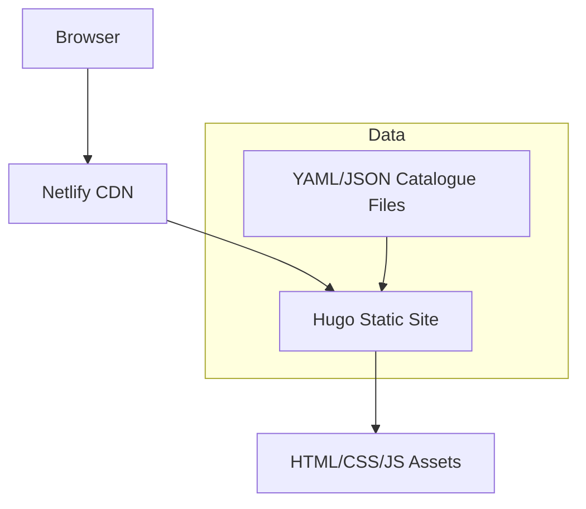

# Architecture Decision Record

## Request
build  a web page with a catalogue for a coffee shop with appropriate coffee themes

## Option 1: Static JAMstack Catalog
Build the coffee shop catalogue as a static site using a static site generator (Hugo) with data stored in YAML/JSON files. The site is deployed to a CDN (Netlify) and served as pure static assets.

**Components:** Hugo (static site generator), Markdown for content, YAML/JSON data files for catalogue items, Netlify CDN for hosting and edge caching

**Pros:** Zero runtime cost – no server to maintain; Fast page load times and excellent SEO; Simple CI/CD – push to GitHub triggers rebuild; Built‑in security – no exposed API surface

**Cons:** Catalog updates require a rebuild and redeploy; No real‑time inventory or user interaction; Limited personalization or dynamic features

**CTQ:** Catalog data consistency; Theme styling (coffee‑themed UI); SEO friendliness; Zero downtime deployments

## Option 2: React SPA with Node.js API
Create a single‑page application in React that consumes a REST API built with Express.js. The API stores catalogue data in PostgreSQL and provides CRUD endpoints. The whole stack is containerised and deployed to a cloud platform (Heroku).

**Components:** React (frontend SPA), Express.js (REST API), PostgreSQL (catalogue database), Docker (containerisation), Heroku (hosting)

**Pros:** Dynamic catalogue updates without redeploy; Scalable backend for future features (orders, reviews); Rich user interactions and personalization; Clear separation of concerns

**Cons:** Higher operational cost and complexity; Requires database maintenance; Potential latency from API calls; More code to write and test

**CTQ:** API performance (latency <200ms); Data integrity and ACID compliance; Secure authentication for admin panel; Scalable deployment strategy

## Decision
Chosen: **option1**

The user only needs a static catalogue page with coffee‑themed styling. A static JAMstack solution delivers the required functionality with minimal complexity, cost, and maintenance. It also guarantees fast load times and excellent SEO, which are important for a coffee shop’s online presence. The alternative SPA+API adds unnecessary backend complexity for a simple catalogue page.

## ADR
# Architecture Decision Record

## Context
The client requests a web page that displays a catalogue of coffee products with a coffee‑themed design. No user authentication, dynamic inventory, or e‑commerce functionality is required.

## Decision
Adopt a **Static JAMstack** architecture using **Hugo** as the static site generator, **YAML/JSON** files for catalogue data, and deploy to **Netlify**.

## Alternatives
1. **React SPA + Node.js API** – Provides dynamic CRUD operations and future extensibility but adds backend complexity and cost.
2. **Server‑side rendered (SSR) framework** – e.g., Next.js with API routes. Adds server runtime and deployment overhead.

## Rationale
- **Simplicity**: No backend to maintain.
- **Performance**: Static assets served from CDN edges.
- **Cost**: Free tier hosting on Netlify.
- **Security**: No exposed API endpoints.
- **Future‑proof**: Easy to add more static pages or rebuild when catalogue changes.

## Consequences
- Catalogue updates require a rebuild and redeploy (handled automatically by Netlify on Git push).
- No real‑time inventory or user interaction.
- All styling and content is controlled via static files, ensuring consistency.

## Acceptance Criteria
- Catalogue items are displayed with coffee‑themed UI.
- Site loads in <200 ms from edge.
- Deployment pipeline automatically rebuilds on Git push.
- No backend server is running in production.

## Diagram

