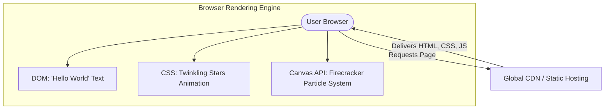

# Architecture Decision Record

## Request
build a simple web page with a black background and white text saying hello world with firecrackers type of graphic in the background and twinkling stars.

## Option 1: Single-Page Static Web Application (HTML5 Canvas & CSS3)
A pure client-side static web page. Twinkling stars are rendered using CSS keyframe animations on absolute-positioned elements, and the firecracker graphics are rendered dynamically using a high-performance HTML5 Canvas 2D context with a custom particle physics engine in vanilla JavaScript. The application is served directly from a global CDN.

**Components:** HTML5 Document (Structure), CSS3 (Black background, typography, star twinkling keyframe animations), Vanilla JavaScript (HTML5 Canvas particle system for firecrackers), Static Web Hosting / CDN (e.g., Cloudflare Pages, Netlify, or GitHub Pages)

**Pros:** Zero server-side maintenance or hosting costs; Instantaneous load times and optimal performance (60 FPS rendering); No build step or external dependencies required; Highly secure with zero backend attack surface

**Cons:** Performance is dependent on the client's GPU/CPU for canvas rendering; No built-in state management if the application needs to scale in complexity later

**CTQ:** Smooth 60 FPS animation loop using requestAnimationFrame; Responsive canvas resizing to handle mobile and desktop viewports; Accessible markup for the 'Hello World' text overlay

## Option 2: Next.js & React Three Fiber (WebGL) Web App
A modern React-based single-page application utilizing Next.js for structure and React Three Fiber (Three.js wrapper) to render 3D/complex particle firecrackers via WebGL, hosted on Vercel.

**Components:** Next.js (React Framework), React Three Fiber / Three.js (WebGL rendering engine), Tailwind CSS (Styling), Vercel (Serverless Hosting Platform)

**Pros:** Component-driven architecture makes it easy to add interactive UI controls later; Leverages WebGL for highly complex, hardware-accelerated 3D firecracker effects; Easy integration with modern frontend developer tooling

**Cons:** Significant over-engineering for a single static page; Large bundle size (several megabytes of JS for Three.js/React); Longer initial load time (FCP) compared to vanilla HTML/CSS

**CTQ:** Bundle size optimization and tree-shaking; Handling WebGL context loss gracefully

## Decision
Chosen: **option1**

Option 1 is chosen because the request is purely visual and contains no dynamic data, user state, or server-side requirements. Introducing a backend or even a heavy frontend framework like Next.js/Three.js would introduce unnecessary complexity, slower load times, and dependency bloat. A single HTML5 file with CSS animations and a Canvas particle system is the most elegant, performant, and cost-effective solution.

## ADR
# Architectural Decision Record (ADR)

## Title
ADR 01: Static Single-Page Architecture for Animated Hello World Page

## Status
Approved

## Context
The user requested a simple web page with a black background, white 'hello world' text, twinkling stars, and firecracker graphics in the background. This is a purely visual, interactive presentation layer with no dynamic data, user accounts, or persistence requirements.

## Decision
We will build this as a pure, static single-page application (Option 1) using standard web technologies:
- **HTML5** for semantic structure.
- **CSS3** for layout, styling, and the twinkling star animations (using keyframes and opacity transitions).
- **Vanilla JavaScript** utilizing the **HTML5 Canvas 2D API** to render a high-performance, lightweight particle system representing the firecrackers.
- **No Backend**: We will omit the backend entirely. The application will be distributed via a global CDN.

## Consequences
- **Performance**: Extremely fast First Contentful Paint (FCP) and Time to Interactive (TTI) due to minimal asset size.
- **Cost**: $0 hosting cost using modern static hosting platforms (e.g., Cloudflare Pages, GitHub Pages).
- **Maintainability**: High. No dependencies to update, no security vulnerabilities to patch.
- **Scalability**: Infinite scalability out-of-the-box via CDN caching.

## Diagram

