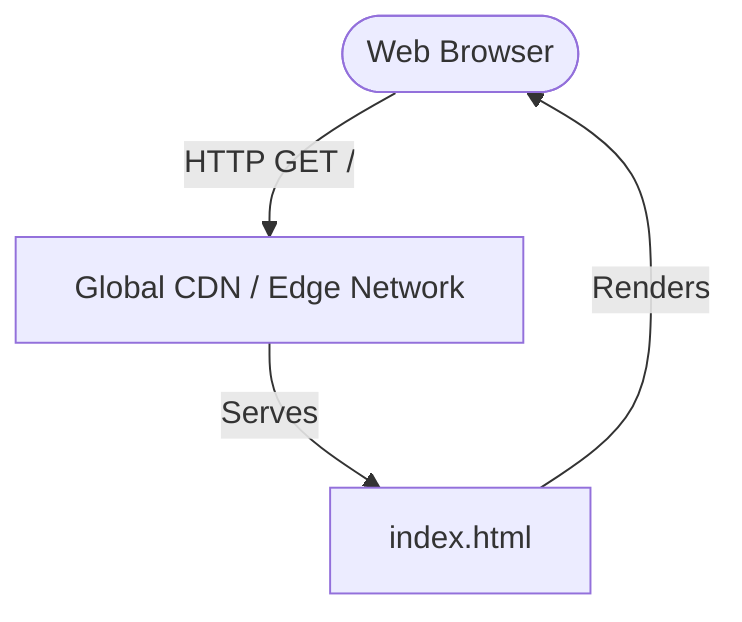

# Architecture Decision Record

## Request
build a simple web page saying hello world.

## Option 1: Static Single-Page Application (No Backend)
A pure HTML5/CSS3 static webpage hosted directly on a global CDN. No server-side runtime is deployed, eliminating maintenance, cost, and security attack vectors.

**Components:** HTML5 / CSS3, Global CDN (Cloudflare Pages / Vercel / Netlify)

**Pros:** Zero hosting cost on standard free tiers; Near-instantaneous load times (sub-100ms globally); Zero server maintenance or security patching required; Infinite scalability out of the box

**Cons:** No native server-side processing or database connectivity (not required for this scope)

**CTQ:** Page Load Time (LCP < 1.0s); Operational Cost ($0); Simplicity of Deployment

## Option 2: Minimal Server-Side Rendered (SSR) Node.js App
A lightweight Node.js Express application running in a container that serves the 'Hello World' HTML page dynamically on request.

**Components:** Node.js, Express.js, Docker, Container Hosting (Render / Fly.io)

**Pros:** Easily extensible if dynamic server-side logic or API integrations are needed later; Full control over HTTP headers and server-side routing

**Cons:** Unnecessary cold-start latency on free container tiers; Requires containerization and dependency management; Higher operational complexity and potential security surface area

**CTQ:** Extensibility; Standard Backend Architecture

## Decision
Chosen: **option1**

Option 1 is chosen because it is the simplest, most performant, and most cost-effective architecture that fully satisfies the requirement. A 'Hello World' page does not require any server-side processing, database access, or dynamic state. Introducing a backend server (as in Option 2) would add unnecessary complexity, latency, cost, and maintenance overhead without providing any functional benefit.

## ADR
# Architectural Decision Record (ADR)

## Context
The requirement is to build a simple web page that displays 'Hello World'. 

## Decision
We will use a static frontend-only architecture (Option 1) deployed directly to a CDN. No backend server will be built or deployed.

## Status
Approved

## Consequences
- **Pros:** Zero operational cost, maximum performance, zero maintenance, and absolute security against server-side exploits.
- **Cons:** If dynamic backend features (e.g., database storage, user authentication) are required in the future, a backend or serverless functions will need to be introduced at that stage.

## Diagram

