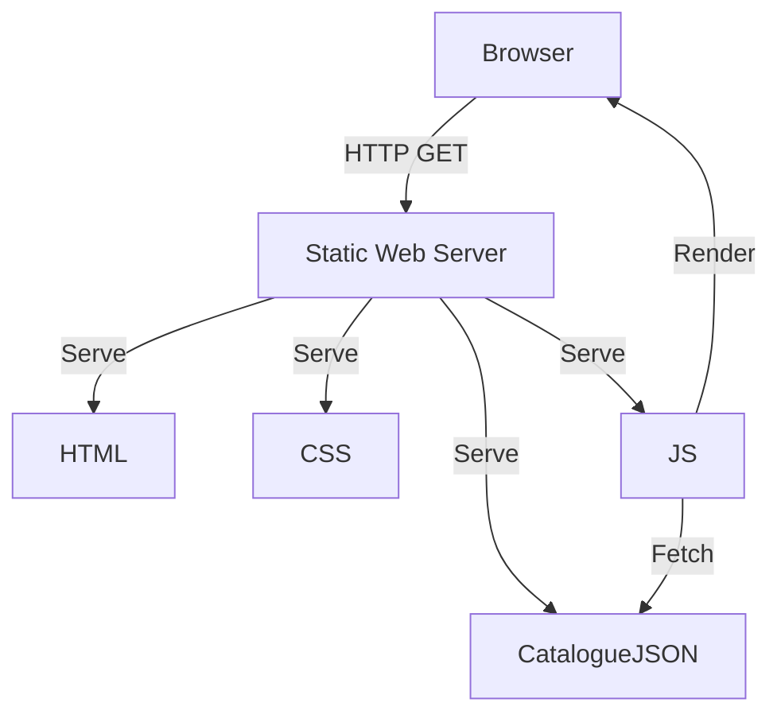

# Architecture Decision Record

## Request
build a webpage for a cafe with coffee themes and a small catalogue to browse.

## Option 1: Static HTML/CSS/JS with JSON Catalogue
A fully static website that uses plain HTML, CSS, and vanilla JavaScript to render a coffee‑themed page with a small catalogue loaded from a local JSON file. The site is served by a minimal static web server (e.g., Netlify, GitHub Pages, or a simple Nginx instance).

**Components:** HTML, CSS (Sass or Tailwind), Vanilla JS (or minimal framework like Alpine.js), JSON data file for catalogue, Static web server (Netlify, GitHub Pages, Nginx)

**Pros:** Zero server‑side code – no deployment of a custom backend; Fast load times and low hosting cost; Easy to host on free static‑site platforms; Simple to maintain – just edit JSON or markdown; No security concerns from exposed APIs

**Cons:** Catalogue updates require a full redeploy or manual file edit; No user authentication or dynamic content; Limited scalability if catalogue grows large; SEO may need additional meta tags or server‑side rendering

**CTQ:** Must display a coffee‑themed UI; Catalogue items must be browsable and searchable (client‑side); Responsive design for mobile and desktop; Fast page load (<200 ms); No backend dependencies

## Option 2: React SPA with Node.js/Express Backend
A single‑page application built with React that consumes a RESTful API built in Node.js/Express. The catalogue is stored in a MongoDB database and served via JSON endpoints. The backend also handles simple admin routes for updating the catalogue. The entire stack is containerized with Docker and deployed to a cloud platform like Heroku or AWS Elastic Beanstalk.

**Components:** React (Create‑React‑App or Vite), Node.js + Express API, MongoDB (Atlas), Docker, CI/CD pipeline, Heroku/AWS Elastic Beanstalk

**Pros:** Dynamic catalogue updates without redeploying the frontend; Scalable architecture for larger catalogues; Potential for future features (user accounts, ordering); Centralized data management; Better SEO with server‑side rendering if needed

**Cons:** Higher complexity – requires backend development and deployment; Increased hosting cost; More maintenance overhead (database, server, Docker); Potential security concerns (API exposure)

**CTQ:** Must display a coffee‑themed UI; Catalogue items must be browsable and searchable (client‑side); Responsive design for mobile and desktop; Fast page load (<200 ms); Secure API endpoints; Scalable to >10k catalogue items

## Decision
Chosen: **option1**

The user request only requires a simple catalogue browsing experience on a coffee‑themed page. There is no need for user authentication, real‑time updates, or complex business logic. A static site with a JSON data file satisfies all functional requirements while keeping the architecture minimal, cost‑effective, and easy to maintain. Therefore, option1 is the best fit.

## ADR
# Architecture Decision Record

## Title
Choose a minimal static architecture for the cafe webpage.

## Date
2026-08-01

## Status
✅ Approved

## Context
The client wants a coffee‑themed webpage with a small catalogue to browse. No user accounts, ordering, or dynamic content is required.

## Decision
Implement a fully static site using HTML, CSS (Tailwind), vanilla JavaScript, and a local JSON file for the catalogue. Host the site on a static hosting platform (Netlify or GitHub Pages).

## Consequences
* **Pros**: Zero backend code, fast load times, low hosting cost, simple deployment.
* **Cons**: Catalogue updates require a redeploy or manual file edit; no dynamic features.
* **Future**: If the client later needs dynamic features, the architecture can be extended to a JAMstack approach or a full stack solution.

---

## Alternatives
1. React SPA + Node.js backend (more complex, higher cost).
2. Static site generator (Hugo, Jekyll) – similar to the chosen approach but adds build tooling.

## Rationale
The minimal static approach meets all functional requirements with the lowest complexity and cost. It also aligns with the coffee‑themed aesthetic and small catalogue size.

---

## Related Decisions
- Deployment target: Netlify (free tier).

## Diagram

