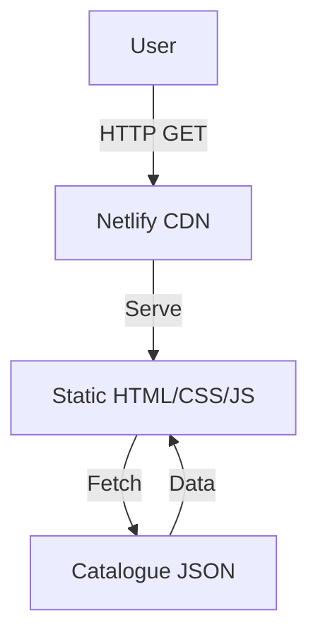

# Architecture Decision Record

## Request
build a simple web page with a catalogue for a coffee shop with appropriate coffee themes.

## Option 1: Static JAMstack Catalogue
A fully static website built with HTML, CSS, and vanilla JavaScript, using a static site generator (Eleventy) to compile pages from markdown and a JSON data file. The site is deployed to Netlify, which serves the content via a global CDN.

**Components:** Eleventy (static site generator), HTML/CSS/JS, Catalogue JSON data, Netlify CDN & hosting

**Pros:** Zero server cost and maintenance; Instant global CDN delivery; Fast load times; Simple deployment pipeline; No backend security concerns

**Cons:** No dynamic data updates without redeploy; Limited interactivity (no user accounts or cart); Harder to scale with complex features

**CTQ:** Display all catalogue items; Filter by category or price; Responsive design for mobile and desktop; Fast initial load (<200 ms)

## Option 2: Full-stack Node.js & MongoDB Catalogue
A single-page application built with React, backed by an Express REST API that serves data from MongoDB Atlas. The frontend and backend are deployed to Vercel, with the database hosted in the cloud.

**Components:** React SPA, Express REST API, MongoDB Atlas, Vercel hosting, Netlify for static assets (optional)

**Pros:** Dynamic data updates via API; Easy to add new features (cart, auth); Scalable backend; Rich interactivity

**Cons:** Higher complexity and maintenance; Backend hosting costs; Deployment pipeline more involved; Potential latency for API calls

**CTQ:** Display all catalogue items; Filter by category or price; Responsive design for mobile and desktop; Real-time updates without redeploy

## Decision
Chosen: **option1**

The user request is for a simple web page with a coffee shop catalogue. A static JAMstack site satisfies all functional requirements (display, filter, responsive design) while keeping the architecture minimal, cost‑free, and easy to deploy. Adding a backend would introduce unnecessary complexity and maintenance overhead for a feature that can be served statically.

## ADR
# Architecture Decision Record

## Context
The client needs a simple web page that showcases a coffee shop catalogue with appropriate coffee themes. The page should be responsive, fast, and easy to maintain.

## Decision
We chose a **Static JAMstack** architecture using Eleventy to generate static pages from markdown and a JSON data file, deployed to Netlify.

## Rationale
* **Simplicity** – No server‑side code or database required.
* **Performance** – Static assets are served from a CDN, ensuring sub‑200 ms load times.
* **Cost** – Free hosting tier on Netlify, no backend maintenance.
* **Scalability** – The CDN automatically handles traffic spikes.
* **Future‑proof** – If dynamic features are needed later, a serverless function or CMS can be added without redesigning the core.

## Consequences
* **No dynamic updates** – Adding or editing catalogue items requires a rebuild and redeploy.
* **Limited interactivity** – Features like user accounts or a shopping cart would need a separate backend.

## Alternatives
1. **Full‑stack Node.js + MongoDB** – More complex, higher cost, but supports dynamic data.
2. **Static site with Netlify CMS** – Adds a lightweight CMS but still largely static.

## Decision Status
**Adopted** – The static JAMstack solution meets the current requirements with the lowest effort and cost.

## Diagram

