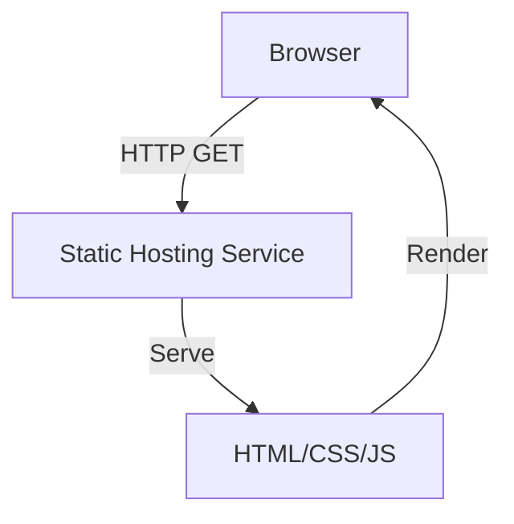

# Architecture Decision Record

## Request
build a webpage with black background, white text saying hello world with 5 twinkling stars in the background.

## Option 1: Static HTML/CSS/JS
Serve a single static page with no server-side logic.

**Components:** index.html, styles.css, script.js, static hosting service (e.g., GitHub Pages, Netlify)

**Pros:** Zero server cost; Fast load times; Easy deployment; No runtime dependencies

**Cons:** Limited interactivity beyond client‑side JS; No dynamic content or user data handling

**CTQ:** Must run in modern browsers; No need for authentication or database

## Option 2: Node.js Express Static Server
Use Express to serve static files, minimal backend layer.

**Components:** server.js, public/index.html, public/styles.css, public/script.js, Node.js, Express

**Pros:** Easy to extend with API endpoints if needed; Consistent environment across dev and prod; Can add middleware for logging, caching

**Cons:** Requires Node runtime; Higher deployment complexity; More maintenance overhead

**CTQ:** Requires Node.js runtime; Server must be kept running even for static content

## Decision
Chosen: **option1**

The request only requires a static page with a black background, white text, and twinkling stars. A pure static deployment eliminates unnecessary backend complexity, reduces cost, and speeds up load times. Therefore, option1 is the simplest and most appropriate architecture.

## ADR
# Architecture Decision Record

## Title
Static vs. Dynamic Hosting for a Simple Webpage

## Context
The requirement is to build a webpage with a black background, white "Hello World" text, and five twinkling stars. No user interaction, data persistence, or server‑side logic is needed.

## Decision
Choose a **Static HTML/CSS/JS** deployment model served by a static hosting service (e.g., GitHub Pages, Netlify, Vercel).

## Rationale
* **Simplicity** – No backend code or runtime environment.
* **Cost‑effective** – Free tier hosting available.
* **Performance** – Static assets are cached globally via CDNs.
* **Maintainability** – Single file set; no server configuration.

## Consequences
* The page is limited to client‑side JavaScript; adding server‑side features would require a migration.
* No ability to handle user authentication or dynamic data.
* Deployment is straightforward: push to a Git repo and enable the static host.

## Alternatives
* **Node.js Express Static Server** – Adds a lightweight backend; unnecessary for the current scope.

## References
* MDN Web Docs – Static Hosting
* Netlify Docs – Deploying a Static Site

## Diagram

