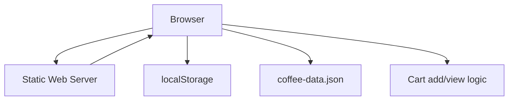

# Architecture Decision Record

## Request
make a web page about a coffee catalogue and I should be able to add things to the cart and view my cart

## Option 1: Static Client-Only Coffee Catalog
A single-page application served from a static web host. The catalog data is bundled as a JSON file, and the shopping cart is managed entirely in the browser using localStorage. No server-side logic is required.

**Components:** index.html, styles.css, app.js, coffee-data.json, localStorage cart logic

**Pros:** Zero server maintenance, instant load times, trivial deployment to GitHub Pages or Netlify; No database or backend code to secure or debug; Easy to prototype and iterate

**Cons:** Cart data is only available on the same device/browser, no cross-device sync; No user authentication or payment processing; Catalog updates require redeploying the static assets

**CTQ:** Must allow adding items to cart; Must allow viewing cart contents; Cart state must persist across page reloads

## Option 2: Full-Stack Coffee Catalog with REST API
A React front‑end communicates with a Node.js/Express back‑end that exposes a REST API. MongoDB stores the coffee catalog and user carts. JWT authentication is optional for future expansion.

**Components:** React SPA (index.html, bundle.js), Express server (routes, controllers), MongoDB database, Docker Compose for dev, CI/CD pipeline, Optional JWT auth middleware

**Pros:** Persistent cart across devices and sessions; Scalable for future features (payment, user accounts); Clear separation of concerns; Can easily add analytics or third‑party services

**Cons:** Requires server deployment and maintenance; Higher initial development effort; More complex CI/CD and security considerations

**CTQ:** Must allow adding items to cart; Must allow viewing cart contents; Cart state must persist across page reloads and devices

## Decision
Chosen: **option1**

The user’s requirements only specify a catalog page with add‑to‑cart and view‑cart functionality. No user accounts, payment processing, or cross‑device persistence are mentioned. A static client‑only solution satisfies all CTQs with minimal complexity, faster load times, and easier deployment. Therefore, the static architecture is the optimal choice.

## ADR
# Architecture Decision Record

## Context
The client needs a web page that displays a coffee catalogue and allows users to add items to a cart and view the cart. No user authentication, payment processing, or multi‑device persistence is required.

## Decision
Adopt a **static client‑only architecture**:
- Serve a single‑page application (SPA) from a static web host.
- Store catalog data as a bundled JSON file.
- Manage cart state in the browser using `localStorage`.

## Rationale
- **Simplicity**: No server, database, or API to develop, test, or deploy.
- **Performance**: Static assets are cached by CDNs, resulting in near‑instant load times.
- **Cost**: Deployable to free tiers (GitHub Pages, Netlify) with no backend costs.
- **Adequate for Requirements**: The CTQs (add to cart, view cart, persistence across reloads) are fully met by client‑side logic.

## Consequences
- Cart data is only available on the same browser/device; it cannot be shared across devices.
- No user authentication or payment integration; future features would require adding a backend.
- Catalog updates require redeploying the static assets.

## Alternatives
1. **Full‑stack REST API** with React front‑end and MongoDB backend.
   - Pros: Persistent cart across devices, future extensibility.
   - Cons: Higher complexity, deployment overhead, unnecessary for current scope.

## Decision
Proceed with the static client‑only architecture. Future enhancements can be added incrementally if new requirements arise.

## Diagram

