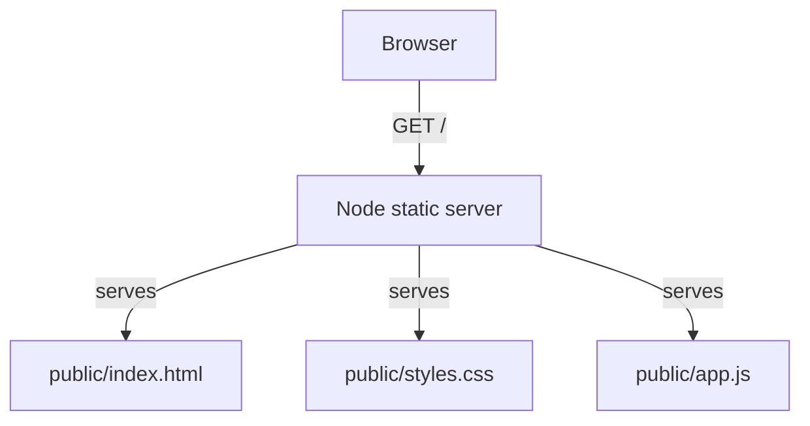

# Architecture Decision Record

## Request
Build a small webpage that shows a short poem with twinkling stars in the background.

## Option 1: Static HTML/CSS/JS Frontend (no backend)
A self-contained static page served by a tiny Node.js static-file server. All visuals are CSS-driven (gradient background, radial-gradient stars, CSS animation) with a small JS enhancement for extra stars when JavaScript is available.

**Components:** public/index.html, public/styles.css, public/app.js, server.js
**Pros:** zero dependencies; fast; secure; no build step
**Cons:** no dynamic data
**CTQ:** zero build step; works offline; loads in <1s; accessible markup

## Option 2: Next.js Frontend
A small Next.js app with React components and SSR.

**Pros:** component model; future-proof
**Cons:** build step required; heavier dependency tree
**CTQ:** modern framework

## Decision
Chosen: **option1**

The request is purely presentational. A static page satisfies every requirement with the smallest footprint, fastest load time and lowest maintenance. A backend or framework would add unnecessary complexity, cost and attack surface for a poem page.

## ADR
We will ship a single `index.html`, `styles.css`, `app.js` and a minimal `server.js` that serves the `public/` directory and exposes `GET /api/health`.

## Diagram

